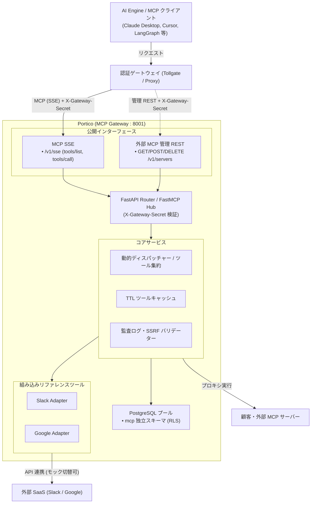
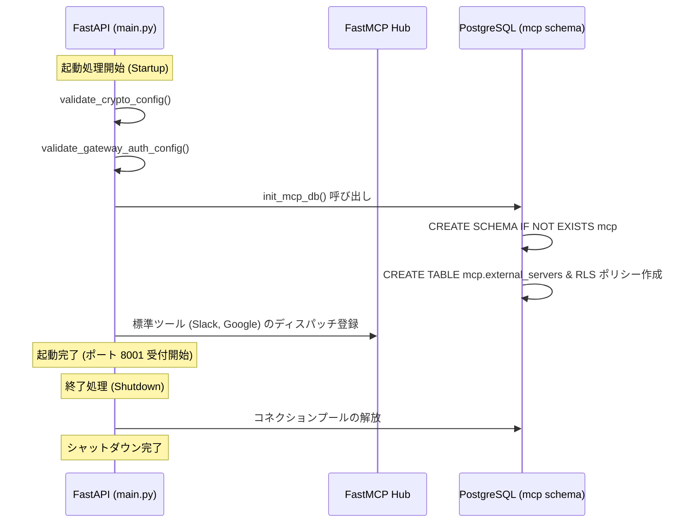

# Portico — アーキテクチャ & FastMCP ハブ仕様書

本ドキュメントは、Portico（MCP Gateway）におけるサービス構造、FastAPI と FastMCP の統合設計、提供エンドポイント、および起動ライフサイクルについて定義する。

---

## 目次

- [1. サービス概要とアーキテクチャ](#1-サービス概要とアーキテクチャ)
- [2. インターフェース設計](#2-インターフェース設計)
- [3. アプリケーションライフサイクル (lifespan)](#3-アプリケーションライフサイクル-lifespan)
- [4. 環境変数マッピング (core/config.py)](#4-環境変数マッピング-coreconfigpy)

---

## 1. サービス概要とアーキテクチャ

MCP Gateway は、AI Engine や MCP クライアント（Claude Desktop, Cursor, LangGraph 等）からの指示を受け取り、実際の外部 SaaS や社内システムへの安全な API 呼び出しを行う実行レイヤーである。

---

## 2. インターフェース設計

MCP Gateway は、ツール探索・実行を MCP プロトコルに一本化し、管理用 API を REST で提供する。

1. **MCP / SSE エンドポイント (`/v1/sse`)**:
   - Model Context Protocol (MCP) 標準に準拠した Server-Sent Events (SSE) ストリーミングインターフェース。
   - ツール一覧取得（`tools/list`）およびツール実行（`tools/call`）を処理。
   - `X-Gateway-Secret` 共有シークレット認証（新旧ローテーション対応）および Tollgate 連携ヘッダー透過に対応。
2. **外部 MCP サーバー管理 REST API (`/v1/servers`)**:
   - テナント別の外部 MCP サーバー登録・一覧・削除を行う管理インターフェース。

---

## 3. アプリケーションライフサイクル (lifespan)

`main.py` の起動時処理において、以下が実行される。

---

## 4. 環境変数マッピング (core/config.py)

MCP Gateway が利用する環境変数一覧。

| 環境変数名 | デフォルト値 | 必須 | 説明 |
|------------|--------------|:---:|------|
| `ENVIRONMENT` | `development` | 任意 | 実行環境 (`development` / `production`) |
| `GATEWAY_SHARED_SECRET` | *(未設定)* | 本番必須 | ゲートウェイ共有シークレット (32文字以上。本番未設定時は起動時エラー) |
| `GATEWAY_SHARED_SECRET_PREVIOUS` | *(未設定)* | 任意 | シークレットローテーション移行期間用の旧シークレット |
| `GATEWAY_SECRET_HEADER` | `X-Gateway-Secret` | 任意 | シークレットを受け取るヘッダー名 |
| `INSECURE_NO_GATEWAY_AUTH` | `false` | 任意 | `true` の場合、シークレット検証をバイパス (開発専用) |
| `ROOT_PATH` | `/gateway` | 任意 | リバースプロキシ（Nginx / ALB）配下用のルートパス |
| `LOG_LEVEL` | `INFO` | 任意 | ログ出力レベル (`DEBUG`, `INFO`, `WARNING`, `ERROR`) |
| `MOCK_EXTERNAL_APIS` | `true` | 任意 | `true` の場合、外部 SaaS を実際に叩かずモックレスポンスを返却 |
| `STORAGE_BACKEND` | `sqlite` | 任意 | マスターストア種別 (`sqlite` / `dynamodb` / `firestore` / `cosmosdb`) |
| `SQLITE_DB_PATH` | `portico.db` | 任意 | SQLite DB ファイルパス (`:memory:` でインメモリ) |
| `CACHE_LAYER` | `two_tier` / `memory` | 任意 | キャッシュ階層 (`two_tier` / `memory` / `valkey` / `none`) |
| `VALKEY_URL` | `redis://localhost:6379/0` | 任意 | 分散キャッシュ Valkey / Redis 接続 URL |
| `SECRET_ENCRYPTION_KEY` | *(未設定時ランダム生成)* | 本番必須 | 外部サーバー認証情報暗号化キー (AES-256) |
| `INTERNAL_API_KEY` | *(未設定時無効)* | 推奨 | 内部サービス専用 API の Bearer 認証キー (`Authorization: Bearer <INTERNAL_API_KEY>`) |
| `DEFAULT_TENANT_ID` | `tenant_default` | 任意 | テナント未指定時の既定テナント ID |
| `ALLOW_LOCAL_MCP_SERVERS` | `true` (dev) / `false` (prod) | 任意 | ローカル / プライベート IP への外部 MCP サーバー登録可否 |
| `MAX_SERVERS_PER_TENANT` | `50` | 任意 | テナント毎の外部 MCP サーバー登録上限数 |
| `TOOL_CACHE_TTL_SECONDS` | `60` | 任意 | ツール集約キャッシュ TTL (秒) |
| `EXTERNAL_MCP_TIMEOUT_SECONDS` | `5.0` | 任意 | 外部 MCP サーバー通信タイムアウト (秒) |
